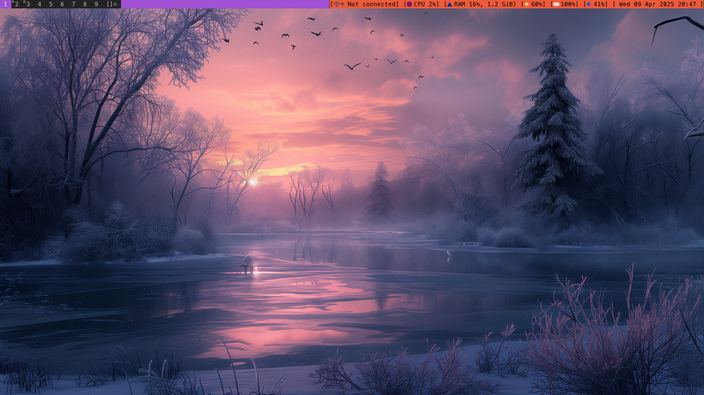
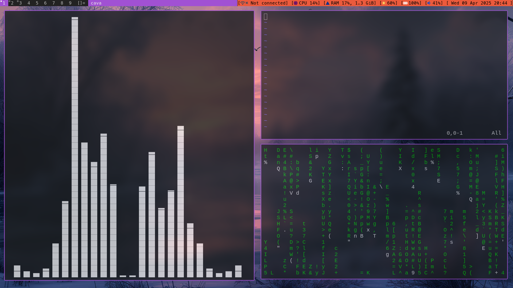
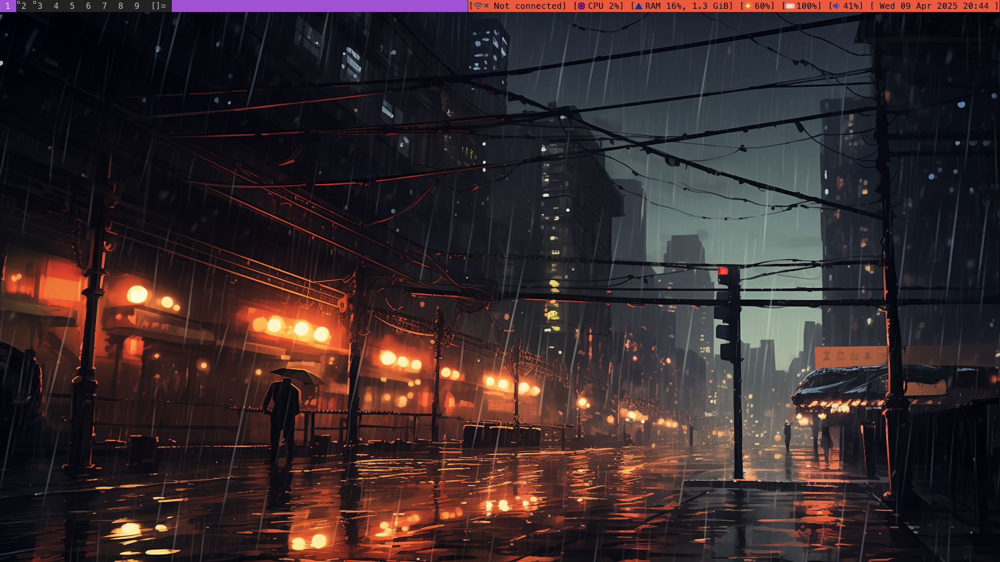
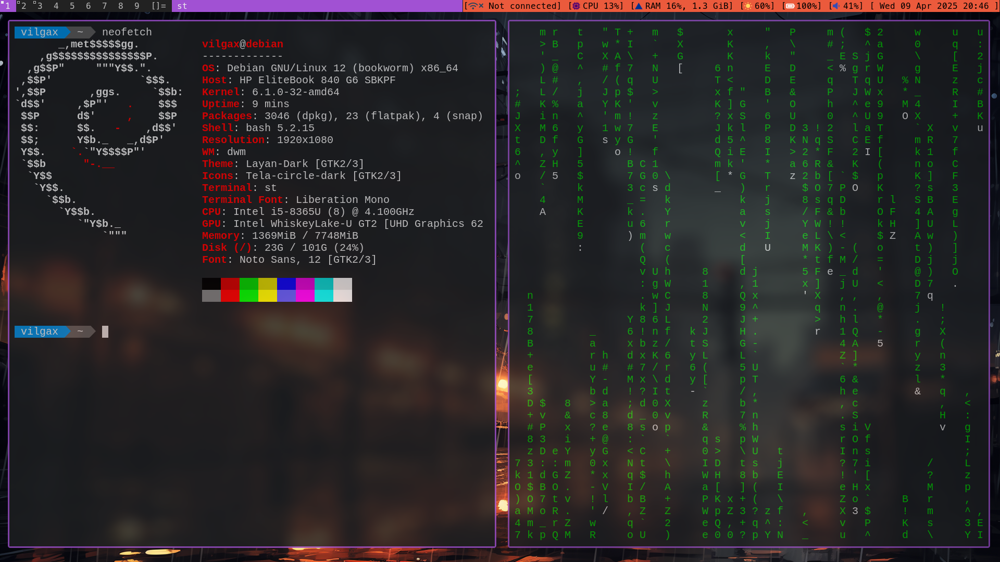
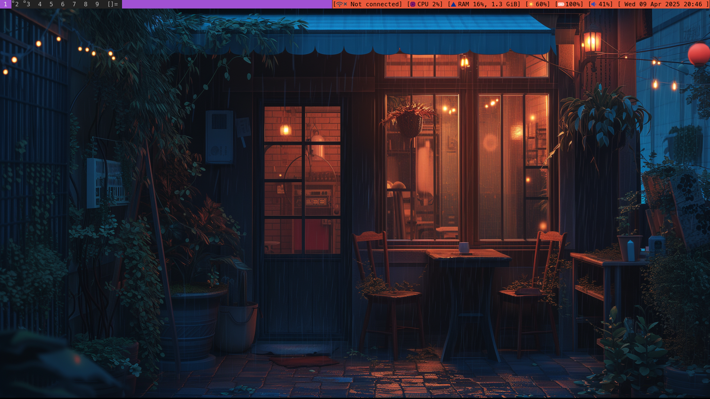

# my-dwm


<div align="center">
  

  # dynamic window manager

</div>

---

dwm is a lightweight, fast, and highly customizable dynamic window manager for X11. It uses a simple tiling layout to maximize screen space and is designed to be minimalistic, offering full control through source code modifications. Ideal for users who want a streamlined, efficient desktop environment.

#### This is my personal dwm:

# Screenshots











# Patch Applied:

- #### **For dwm**  
  - [alwayscenter](https://dwm.suckless.org/patches/alwayscenter/)
  - [cool autostart](https://dwm.suckless.org/patches/cool_autostart/)
  - [fullgaps](https://dwm.suckless.org/patches/fullgaps/)
  - [push](https://dwm.suckless.org/patches/push/)
  - [status2d](https://dwm.suckless.org/patches/status2d/)
- #### **For st** 
  - [scrollback](https://st.suckless.org/patches/scrollback/)
- #### **For dmenu** 
  - [border](https://tools.suckless.org/dmenu/patches/border/)
  - [center](https://tools.suckless.org/dmenu/patches/center/)
  - [numbers](https://tools.suckless.org/dmenu/patches/numbers/)

# Requirements

#### Dependencies

On Debian based distributions (e.g. Ubuntu), the needed packages are:
```bash
sudo apt install build-essential git xorg libx11-dev libx11-xcb-dev libxcb-res0-dev libxinerama-dev libxft-dev libimlib2-dev pamixer brightnessctl
```

On Arch, the needed packages are:
```bash
sudo pacman -S base-devel git xorg-xinit libx11 libxcb libxinerama libxft imlib2 pamixer brightnessctl
```

# Installation

Clone the repository:
```bash
git clone https://github.com/Wnanovex/my-dwm.git
cd my-dwm
```

Compile and Install:
```bash
make
sudo make install clean
```

- Create or Edit your `~/.xinitrc` file then add inside it `exec dwm`.
- To display dwm as the window manager when logging in, you should to create `dwm.desktop` file in `/usr/share/xsessions/` and add these lines inside it:
    ```text
    [Desktop Entry]
    Encoding=UTF-8
    Name=dwm
    Comment=Log in using the Dynamic Window Manager
    Exec=/usr/local/bin/dwm
    Icon=/usr/local/bin/dwm.png
    TryExec=/usr/local/bin/dwm
    Type=XSession
    ```
    
# Install Nerd Font

Installing Nerd Font will display icons of status bar. I use [MesloLGSNerdFont-Regular](https://github.com/ryanoasis/nerd-fonts/blob/master/patched-fonts/Meslo/S/Regular/MesloLGSNerdFont-Regular.ttf). To add it on your fonts run these commands:

```bash
mkdir -p ~/.local/share/fonts
mv ~/Downloads/MesloLGSNerdFont-Regular.ttf ~/.local/share/fonts
```

